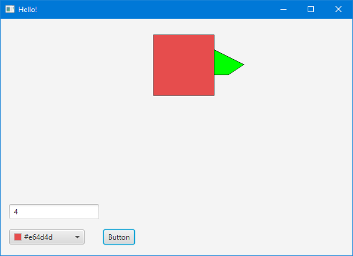
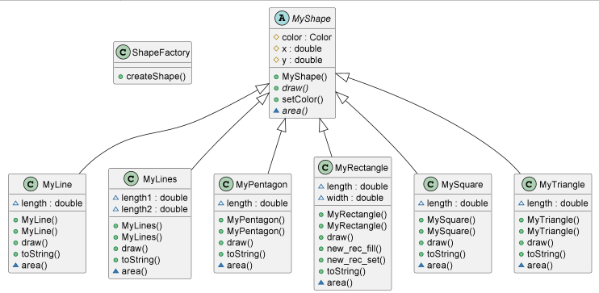

# TASK 4. ИТЕРАТОР

---
**Задача:**

> Необходимо организовать создание фигур в окне программы.
> Для создания фигур используются свои классы

Технологический стек: Java, JavaFX.

**Скриншоты**
* Cкриншот работоспособности программы:

## Зависимости

---
Язык разработки: Java.
Для создания пользовательского интерфейса используется платформа JavaFX.

### Диаграмма классов модели приложения

